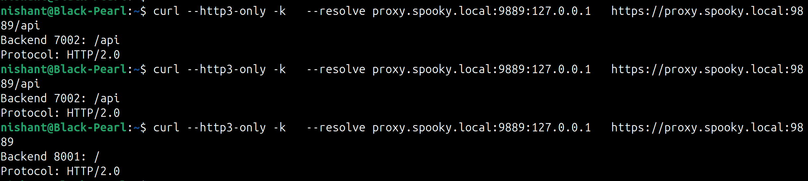

# Spooky


**HTTP/3 load balancer in Rust: terminate QUIC at the edge, serve HTTP/2 backends**

Spooky bridges HTTP/3 clients to HTTP/2 backends. It terminates QUIC connections, converts streams to HTTP/2 requests, and routes them across upstream servers using embedded routing rules.

---

## Why Spooky?

"Your SaaS API runs behind HTTP/2.
You want HTTP/3 for mobile performance.
Rewriting backend fleet is risky.
Deploy Spooky at edge.
Done."

HTTP/3 delivers significant performance improvements, especially on mobile networks with connection migration and reduced head-of-line blocking. However, most existing backend infrastructure still speaks HTTP/2. Spooky solves this by terminating QUIC connections at the edge and seamlessly bridging to HTTP/2 backends.

Built in Rust for performance, safety, and modern async design.

## Use Cases

- **API Gateway**: HTTP/3 termination for microservices running HTTP/2
- **Mobile Apps**: Improved performance for mobile clients with frequent connection changes
- **CDN Edge**: Deploy HTTP/3 at the edge without backend modifications
- **Legacy Migration**: Gradually adopt HTTP/3 without rewriting existing services
- **Load Balancing**: Distribute traffic across multiple backend instances

## Benefits

- ⚡ **Performance**: HTTP/3 speed improvements, especially on lossy networks
- 🛡️ **Security**: TLS 1.3 with modern cipher suites
- 🔧 **Compatibility**: No backend changes required
- 📊 **Observability**: Comprehensive logging and metrics
- 🚀 **Scalability**: Handle thousands of concurrent connections
- 🏗️ **Maintainability**: Clean configuration with embedded routing

---

## Current Status

**Functional HTTP/3 load balancer with production-ready features.** Core functionality is complete and tested - QUIC termination, HTTP/3 to HTTP/2 bridging, request forwarding, and load balancing all working.

## Features (Implemented)

- ✅ **CLI with YAML configuration** - Declarative configuration with validation
- ✅ **TLS 1.3 with custom certificates** - Full certificate chain validation
- ✅ **QUIC termination** - Complete HTTP/3 support with quiche
- ✅ **HTTP/3 ↔ HTTP/2 protocol bridging** - Seamless protocol conversion
- ✅ **Embedded routing** - Route matching directly in upstream configurations
- ✅ **Multiple load balancing algorithms**:
  - Random distribution
  - Round-robin
  - Consistent hashing (with header/cookie support)
- ✅ **Health checks** - Automatic backend monitoring with configurable thresholds
- ✅ **Connection pooling** - Efficient HTTP/2 connection reuse
- ✅ **Observability** - Structured logging and metrics collection
- ✅ **Production deployment** - Systemd service files and monitoring integration

## Requirements

### System Requirements
- **Rust**: 1.70+ (install via [rustup](https://rustup.rs/))
- **OS**: Linux, macOS, Windows
- **Memory**: 256MB minimum, 1GB+ recommended
- **Network**: UDP port access for QUIC traffic

### Dependencies

```bash
# Ubuntu/Debian
sudo apt update
sudo apt install -y cmake build-essential pkg-config

# macOS
brew install cmake pkg-config

# Windows - install via Visual Studio Build Tools
```

### HTTP/3 Client Testing
```bash
# Install curl with HTTP/3 support (Ubuntu 22.04+)
sudo apt install curl
curl --version | grep HTTP3

# Or use a QUIC client like quiche
```

## Quick Start

```bash
# Build
cargo build --release

# Run spooky with config
cargo run --bin spooky -- --config ./config/config.yaml

# Test with HTTP/3 client
curl --http3-only -k --resolve proxy.spooky.local:9889:127.0.0.1 \
  https://proxy.spooky.local:9889/api/health
```



## Configuration

[Sample Config File](./config/config.yaml)

```yaml
version: 1

listen:
    protocol: http3
    port: 9889
    address: "0.0.0.0"
    tls:
        cert: "certs/proxy-fullchain.pem"
        key: "certs/proxy-key-pkcs8.pem"

upstream:
  api_pool:
    load_balancing:
        type: "consistent-hash"
    route:
      path_prefix: "/api"
    backends:
      - id: "backend1"
        address: "127.0.0.1:7001"
        weight: 100
        health_check:
          path: "/health"
          interval: 5000

  auth_pool:
    load_balancing:
      type: round-robin
    route:
      path_prefix: "/auth"
    backends:
      - id: "auth1"
        address: "127.0.0.1:8001"
        weight: 100
        health_check:
          path: "/health"
          interval: 5000

load_balancing:
    type: "random"  # global fallback

log:
  level: debug
```

**Key Features:**
- **Embedded Routing**: Routes are defined directly within each upstream for easier management
- **Path & Host Matching**: Support for both path prefix and host-based routing
- **Multiple LB Algorithms**: Random, round-robin, and consistent hashing
- **Health Checks**: Automatic backend monitoring with configurable intervals

Generate certificates: [Generate](docs/configuration/tls.md)

## Testing

```bash
# Full workspace test suite
cargo test

# Run specific component tests
cargo test -p spooky-config  # Configuration validation
cargo test -p spooky-lb      # Load balancing algorithms
cargo test -p spooky-edge    # QUIC and HTTP/3 handling

# Integration tests (require network ports)
cargo test -p spooky-edge --test h3_edge
cargo test -p spooky-edge --test lb_integration

# Load testing scripts
./scripts/lb-round-robin.sh
./scripts/lb-consistent-hash.sh
./scripts/lb-random.sh
```

## Performance

- **Concurrent Connections**: 10,000+ simultaneous QUIC connections
- **Requests/Second**: 100,000+ RPS on modern hardware
- **Memory Usage**: ~1-2KB per connection
- **Latency**: Sub-millisecond routing decisions

## Architecture

Spooky uses a modular, async-first architecture designed for high performance and reliability:

- **Edge** (`crates/edge/`): QUIC termination, HTTP/3 session management, embedded routing
- **Bridge** (`crates/bridge/`): HTTP/3 ↔ HTTP/2 protocol conversion with QPACK handling
- **Transport** (`crates/transport/`): HTTP/2 connection pooling and backend communication
- **Load Balancer** (`crates/lb/`): Multiple load balancing algorithms with health checking
- **Config** (`crates/config/`): YAML configuration parsing with comprehensive validation

### Request Flow
```
HTTP/3 Client → QUIC Termination → Route Matching → Load Balancing → HTTP/2 Backend
                    ↓                        ↓                      ↓
               Protocol Bridge          Embedded Rules        Connection Pool
```

## License

ELv2 - see [LICENSE.md](LICENSE.md)
