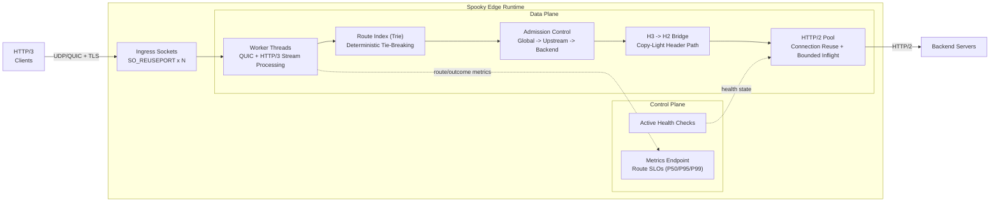

# Spooky

Spooky lets HAProxy, NGINX, and Apache environments adopt QUIC/HTTP/3 in days instead of quarters.

## Overview

Modern clients increasingly expect HTTP/3 support, but most production backends still use HTTP/2. Spooky bridges this gap by:

- Terminating QUIC connections with TLS 1.3
- Converting HTTP/3 streams to HTTP/2 requests
- Load balancing across backend pools with health checks
- Supporting path and host-based routing
- Enforcing bounded request/response memory with deterministic overload failures

## Performance

On a laptop (Intel i5-11320H, 4 physical cores, 15 GiB RAM), loopback backends:

| Scenario | Throughput | Success | p99 |
|---|---|---|---|
| Burst (120 concurrent) | **21,235 req/s** | 100% | 102 ms |
| Burst (80 concurrent) | **14,691 req/s** | 100% | 65 ms |
| Slow upstream (80 concurrent) | **9,549 req/s** | 100% | 62 ms |
| QUIC packet loss (120 concurrent) | **12,500 req/s** | 100% | 91 ms |

See [load test results](docs/benchmarks/load.md) for full details.

## Quick Start

```bash
# Build release binary
cargo build --release

# Generate self-signed certificates
make certs-selfsigned

# Run with default configuration
./target/release/spooky --config config/config.development.yaml

# Test with HTTP/3 client
curl --http3-only -k \
  --resolve proxy.spooky.local:9889:127.0.0.1 \
  https://proxy.spooky.local:9889/api/health
```

## System Requirements

- **Rust**: 1.85 or later (edition 2024)
- **OS**: Linux
- **Permissions**: Root is only required for privileged ports (`<1024`); non-privileged ports run unprivileged
- **Network**: UDP port access for QUIC traffic
- **Memory**: 256MB minimum, 1GB recommended

### Build Dependencies

```bash
# Ubuntu/Debian
sudo apt install cmake build-essential pkg-config

# macOS
brew install cmake pkg-config
```

## Configuration

Spooky uses YAML configuration with validation at startup. See [configuration reference](docs/configuration/reference.md) for complete documentation.

Repository config templates:

- `config/config.production.yaml`: secure production baseline (`upstream_tls.verify_certificates=true`)
- `config/config.development.yaml`: explicit local-development profile (allows insecure upstream TLS)
- `config/config.sample.yaml`: full reference sample with all major sections

### Ingress Compatibility Posture

Spooky uses **HTTP/3 over QUIC** as its native ingress data plane and also runs a **TLS bootstrap ingress** for HTTP/1.1 and HTTP/2 clients.

- Native path: HTTP/3 over QUIC on UDP.
- Compatibility path: HTTP/1.1 + HTTP/2 over TLS on TCP for modern browser compatibility and `Alt-Svc` discovery/upgrade to HTTP/3.
- External frontends (CDN/LB/reverse proxy) are still supported when you want additional edge policy, WAF, or protocol mediation.

### Minimal Example

```yaml
version: 1

listen:
  protocol: http3
  port: 9889
  address: "0.0.0.0"
  tls:
    cert: "certs/cert.pem"
    key: "certs/key.pem"

upstream:
  api_backend:
    load_balancing:
      type: "round-robin"
    route:
      path_prefix: "/api"
    backends:
      - id: "api-1"
        address: "127.0.0.1:8001"
        weight: 100
        health_check:
          path: "/health"
          interval: 5000

  default_backend:
    load_balancing:
      type: "random"
    route:
      path_prefix: "/"
    backends:
      - id: "default-1"
        address: "127.0.0.1:8080"
        weight: 100
        health_check:
          path: "/health"
          interval: 5000

log:
  level: info
```

### Key Configuration Features

**Upstream Pools**: Define multiple named upstream groups. Each pool configures its own routing rules and load balancing strategy independently.

**Routing**: Route requests based on path prefix and hostname. The most specific match (longest prefix) wins.

**Load Balancing**: Per-upstream pool strategies: random, round-robin, consistent-hash, least-connections, latency-aware, and sticky-cid.

**Health Checks**: Automatic backend health monitoring with configurable intervals, timeouts, and thresholds.

## Architecture

Spooky uses a modular architecture with clear separation of concerns:


```mermaid
flowchart LR
    client["HTTP/3<br/>Clients"] -->|UDP/QUIC + TLS| ingress

    subgraph edge["Spooky Edge Runtime"]
        direction TB
        ingress["Ingress Sockets<br/>SO_REUSEPORT x N"]

        subgraph data_plane["Data Plane"]
            direction TB
            workers["Worker Threads<br/>QUIC + HTTP/3 Stream Processing"] --> route["Route Index (Trie)<br/>Deterministic Tie-Breaking"]
            route --> admission["Admission Control<br/>Global -> Upstream -> Backend"]
            admission --> bridge["H3 -> H2 Bridge<br/>Copy-Light Header Path"]
            bridge --> pool["HTTP/2 Pool<br/>Connection Reuse + Bounded Inflight"]
        end

        subgraph control_plane["Control Plane"]
            direction TB
            health["Active Health Checks"]
            metrics["Metrics Endpoint<br/>Route SLOs (P50/P95/P99)"]
        end
    end

    ingress --> workers
    pool -->|HTTP/2| backend["Backend Servers"]
    health -. health state .-> pool
    workers -. route/outcome metrics .-> metrics
```

### Components

- **Edge** (`crates/edge`): QUIC termination, HTTP/3 session management
- **Bridge** (`crates/bridge`): HTTP/3 to HTTP/2 protocol conversion
- **Transport** (`crates/transport`): HTTP/2 connection pooling
- **Load Balancer** (`crates/lb`): Backend selection algorithms and health tracking
- **Config** (`crates/config`): Configuration parsing and validation

## Features

**Core Functionality**
- HTTP/3 and QUIC (RFC 9114, RFC 9000)
- TLS 1.3 with certificate chain validation
- HTTP/2 backend connectivity
- Streaming request/response handling with bounded queues and body caps
- Deterministic cap-breach behavior (`413`/`503`) under pressure

**Load Balancing**
- Random distribution
- Round-robin rotation
- Consistent hashing (with configurable replicas)
- Least-connections routing
- Latency-aware routing (EWMA + in-flight pressure)
- Sticky sessions via QUIC CID hashing
- Per-upstream strategy configuration

**Routing**
- Path prefix matching
- Host-based routing
- Longest-match selection for overlapping routes

**Health Management**
- Active health checks with HTTP probes
- Configurable failure thresholds and cooldown periods
- Automatic backend removal and recovery

**Observability**
- Structured logging with multiple levels (including Spooky-themed aliases)
- File-based log output via `log.file.enabled` and `log.file.path`
- Backend latency tracking
- Health transition logging
- Optional routing decision transparency logs (`observability.routing`)

## Testing

```bash
# Run all tests
cargo test

# Run specific component tests
cargo test -p spooky-config
cargo test -p spooky-lb
cargo test -p spooky-edge

# Run integration tests
cargo test -p spooky-edge --test lb_integration
cargo test -p spooky-edge --test h3_bridge

# Run load scenarios (burst / slow-upstream / quic-loss profile)
make load-scenarios
```


## Project Status

**Beta.** Spooky is feature-complete for core HTTP/3 edge proxying and can be used in controlled production rollouts. It remains pre-GA, so operators should follow the deployment hardening guidance and roll out progressively.

See [release maturity](docs/release-maturity.md) for scope and GA exit criteria, and [roadmap](docs/roadmap.md) for planned improvements.

## Documentation

- [Architecture Overview](docs/architecture.md)
- [Configuration Reference](docs/configuration/reference.md)
- [TLS Setup Guide](docs/configuration/tls.md)
- [Load Balancing Guide](docs/user-guide/load-balancing.md)
- [Production Deployment](docs/deployment/production.md)
- [Troubleshooting](docs/troubleshooting/common-issues.md)

## Development

See [contributing guide](CONTRIBUTING.md) for development setup and guidelines.

```bash
# Development build
cargo build

# Run with debug logging
RUST_LOG=debug cargo run -- --config config/config.development.yaml

# Format code
cargo fmt

# Lint
cargo clippy
```

## License

Elastic License 2.0 (ELv2) - see [LICENSE](LICENSE.md)
